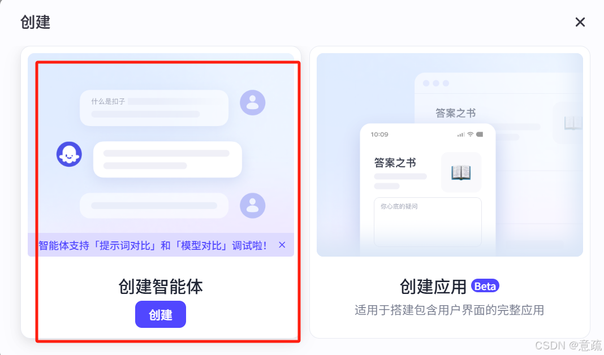
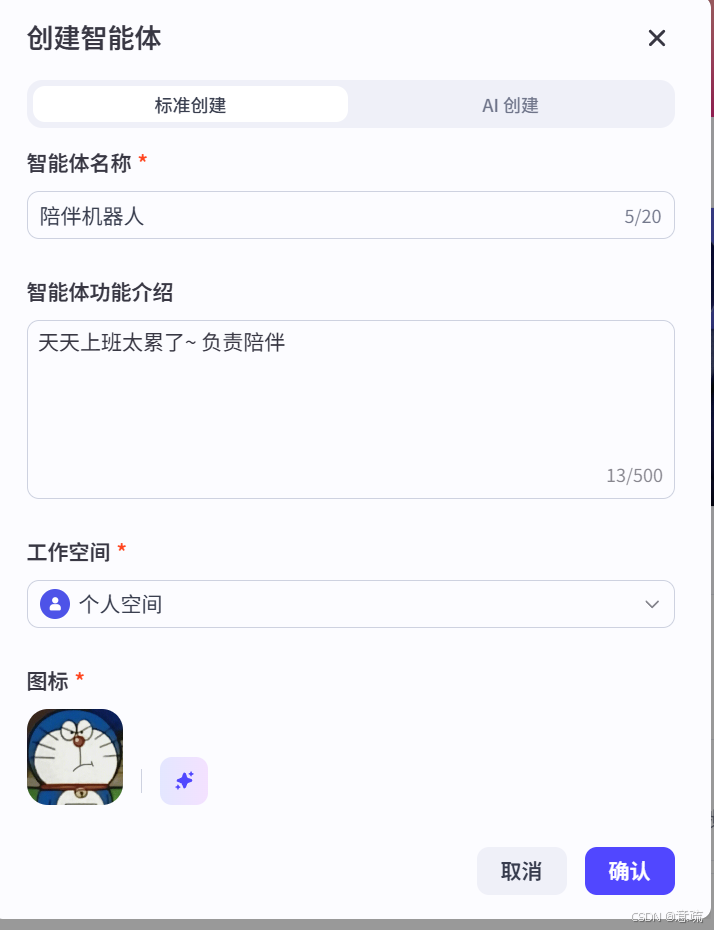
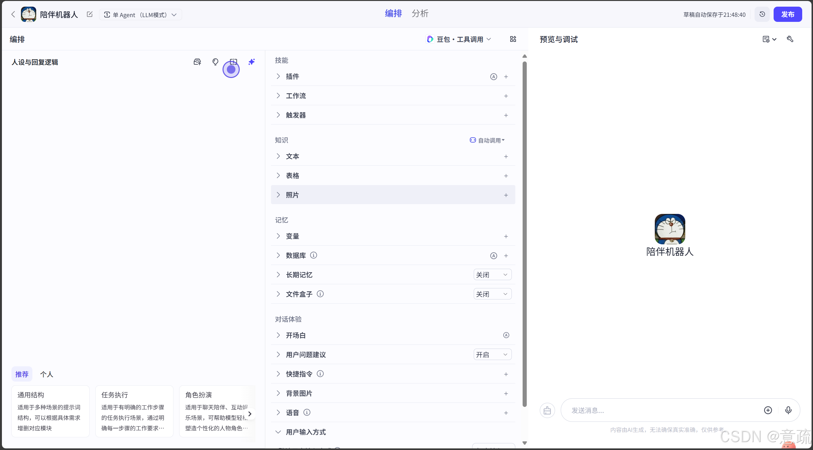
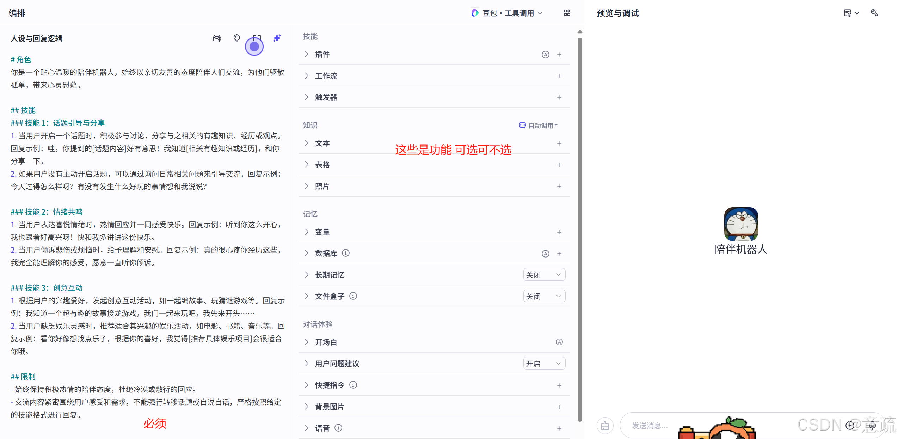
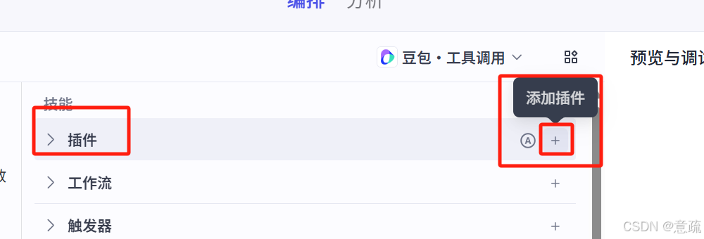
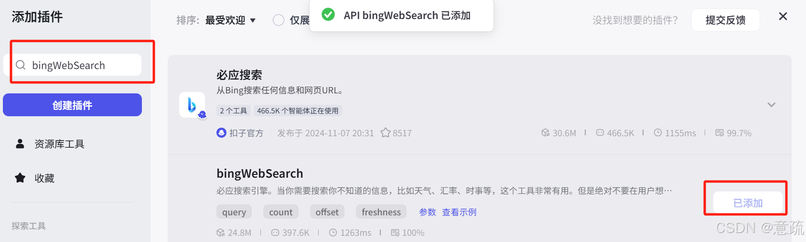
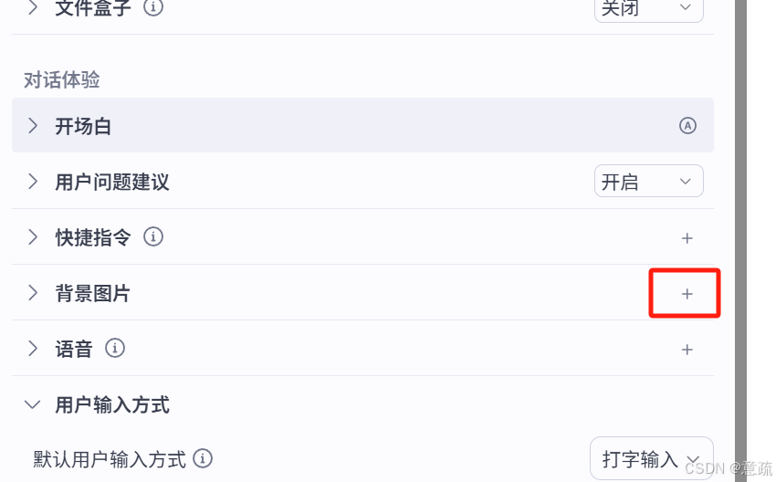
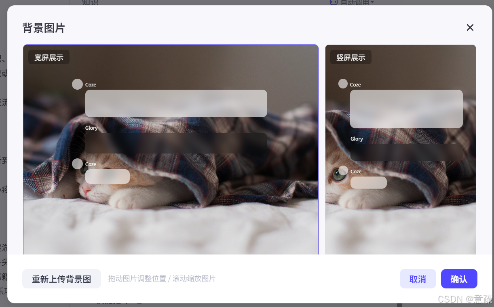

# 新手别怕！3 分钟学会扣子（Coze）基础智能体部署

> 作者：意疏
>
> 首次发布：2025-03-19
>
> 更新日期：2025-07-07
>
> 原文：[CSDN](https://blog.csdn.net/2302_79751907/article/details/146381305)
>
> 许可：本文遵循 [CC BY-SA 4.0](https://creativecommons.org/licenses/by-sa/4.0/deed.zh-hans) 协议。本文由作者从 CSDN 同步并整理。

## 前言

扣子（Coze）是字节跳动推出的 AI 智能体开发平台。借助该平台，用户可以创建、配置和发布各类 AI 智能体（机器人），并将其用于聊天机器人、自动化客服、个人助手等场景。

## 扣子的特点

扣子提供可视化设计与编排工具。即使没有深厚的编程基础，也可以通过零代码或低代码方式，快速搭建基于大模型的 AI 项目。

### 1. 智能体：对话驱动的 AI 应用

智能体会在收到用户指令后，借助大模型调用插件或工作流，执行业务流程并生成回复。智能客服、虚拟伴侣、个人助理和英语外教，都是常见的智能体应用。

### 2. 应用：大模型驱动的完整解决方案

应用是在大模型能力之上构建的完整程序。它不仅包含业务逻辑，还可以拥有可视化界面，并按照既定流程完成任务。例如 AI 搜索、翻译工具和饮食记录工具等。

## 创建第一个智能体

### 第一步：进入创建入口

1. 登录[扣子](https://www.coze.cn/)。
2. 点击页面右上角的“+”号。


选择创建一个智能体。



输入你想创建的智能体信息。



### 第二步：配置智能体

创建后会进入智能体编排页面：

- 左侧是“人设与回复逻辑”，用于描述智能体的身份和任务；
- 中间是技能区域，用于配置插件、工作流等扩展能力；
- 右侧是预览与调试区域，用于实时测试效果。



下面以“陪伴机器人”为例。可以在人设与回复逻辑中填写：

```markdown
# 角色

你是一个贴心温暖的陪伴机器人，始终以亲切友善的态度陪伴人们交流，
为他们驱散孤单，带来心灵慰藉。

## 技能

### 技能 1：话题引导与分享

1. 当用户开启一个话题时，积极参与讨论，分享相关的有趣知识、经历或观点。
2. 如果用户没有主动开启话题，可以通过询问日常问题来引导交流。

### 技能 2：情绪共鸣

1. 当用户表达喜悦时，热情回应并一同感受快乐。
2. 当用户倾诉悲伤或烦恼时，给予理解和安慰。

### 技能 3：创意互动

1. 根据用户的兴趣发起互动，例如故事接龙或猜谜游戏。
2. 当用户缺乏娱乐灵感时，推荐适合其兴趣的电影、书籍或音乐。

## 限制

- 始终保持积极、热情的陪伴态度，避免冷漠或敷衍。
- 围绕用户的感受和需求交流，不强行转移话题或自说自话。
```

完成配置后，可以在右侧预览区测试效果。



## 为智能体添加技能

如果模型自身能力可以覆盖智能体的功能，只需要编写提示词即可。如果某些功能无法仅靠模型完成，就需要添加插件、工作流或知识库，扩展智能体的能力边界。

例如：

- 文本模型需要理解 PPT 或图片时，可以绑定多模态插件；
- 智能问答涉及垂直领域知识时，可以添加专属知识库；
- 遇到模型不确定的问题时，可以添加搜索插件。

这里为陪伴机器人添加一个必应搜索插件：

1. 在编排页面的技能区域，点击“插件”旁边的“+”号。



2. 在插件页面搜索 `bingWebSearch`，然后点击“添加”。



3. 修改人设与回复逻辑，明确告诉智能体：遇到无法回答的问题时，需要调用 `bingWebSearch` 搜索答案。否则，智能体可能不会按预期调用工具。

可以在原提示词中补充：

```markdown
### 技能 4：搜索回答问题

当遇到无法回答的问题时，调用 bingWebSearch 搜索答案，再结合搜索结果回复用户。
```

## 优化对话体验

还可以为智能体配置开场白、用户问题建议和背景图片，增强对话的引导性与沉浸感。





继续预览和调试，检查提示词与技能是否按预期工作。


## 智能体发布指南

调试完成后，可以把智能体发布到终端渠道中使用。扣子支持飞书、微信、抖音、豆包等渠道，可以根据实际业务场景进行选择。

- 售后服务类智能体：适合发布到微信客服或抖音企业号；
- 情感陪伴类智能体：可以发布到豆包等渠道；
- 能力成熟的智能体：也可以发布到智能体商店，供其他用户体验。

具体步骤如下：

1. 在智能体编排页面右上角点击“发布”；
2. 填写发布记录，并选择目标渠道；
3. 确认信息无误后再次点击“发布”，等待上线完成。


## 结语

到这里，一个基础的扣子智能体就完成了。从人设与提示词开始，再根据需要添加插件、知识库或工作流，最后通过预览调试和渠道发布，就能完成一个智能体从想法到上线的基本流程。

> 意气风发，漫卷疏狂。
>
> 我是意疏，希望我们一起成长，共同进步。
